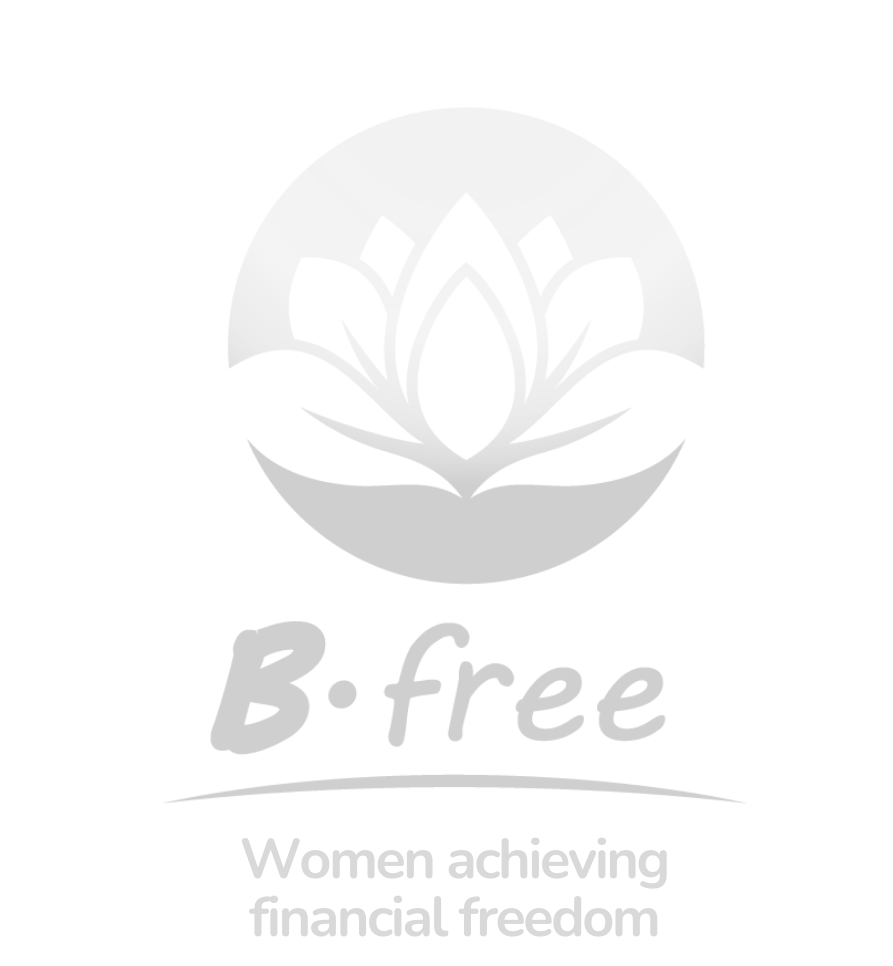

<p align="center">

</p>


# B.free

B.free is a community financing blockchain platform for rural women that uses the most popular mechanism that they use in Mexico: “tanda” where women raise money regularly but in a better version called “tanda gratis” that doubles the amount of money that women manage to raise.
If a “free tanda” brings together 5 women who contribute 1,000 pesos each per month to have a purse of 5,000 pesos each month before, now with “free tanda” they receive 10,000 each per month. To make it attractive to use our platform and learn about blockchain and financial freedom.

## Frontend

First, run the development server:

```bash
npm run dev
# or
yarn dev
# or
pnpm dev
# or
bun dev
```

Open [http://localhost:3000](http://localhost:3000) with your browser to see the result.


## Backend | Smart Contracts

The solidity Smart Contracts are located in the SmartContracs/contracts folder.
